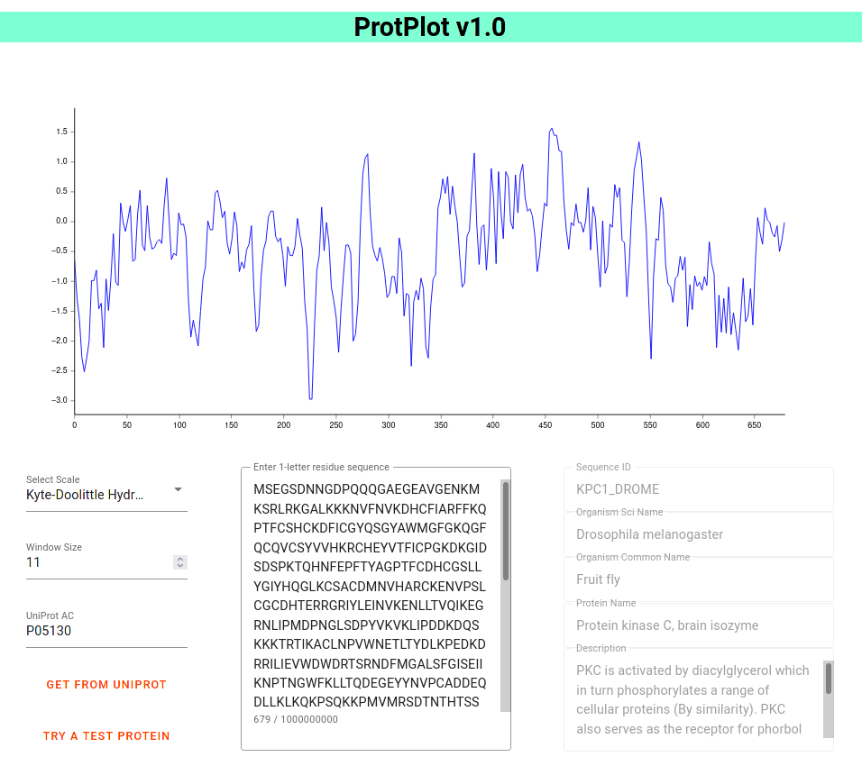

# ProtPlot

A client-side static web tool for generating protein residue plots.
Accepts directly entering a string, as well as a UniProt Accession number, in which case it will fetch() the required information from the UniProt API.

### Comparison to [`ProtScale`](https://web.expasy.org/protscale/)

- Static site, completely client side. There's no need to wait for the request to get to the server and back. Saves a few seconds and streamlines the experience.
- The generated graph automatically updates as you change the residue string, window size, amino acid scale, or other options.

Live @ [https://argonaut0.github.io/ProtPlot/](https://argonaut0.github.io/ProtPlot/)

### Libs

- https://sveltematerialui.com/
- https://florence.spatialnetworkslab.org/
- https://html2canvas.hertzen.com/
